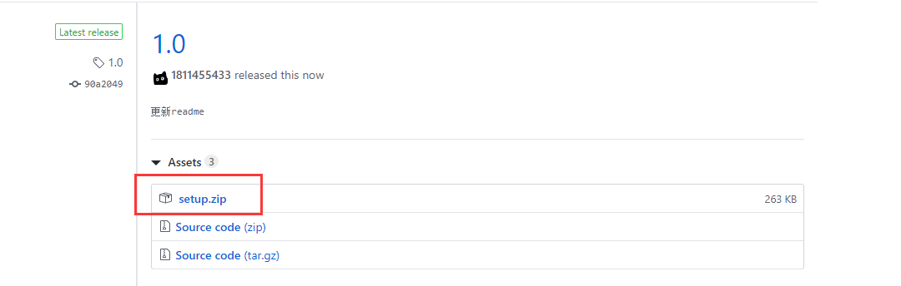
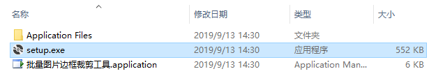
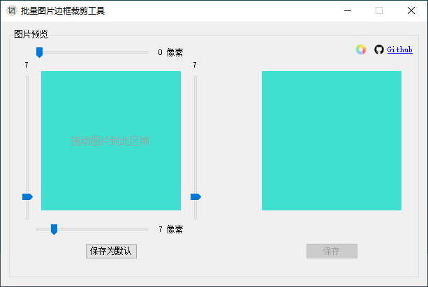
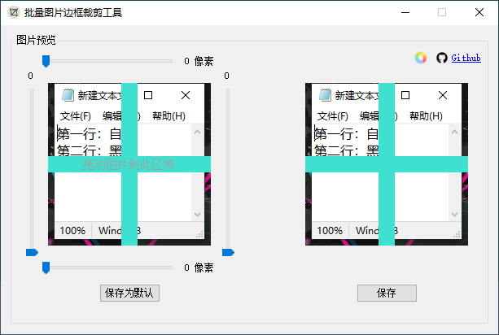
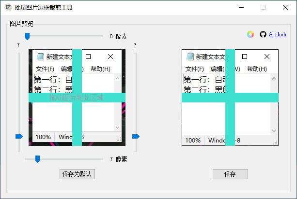
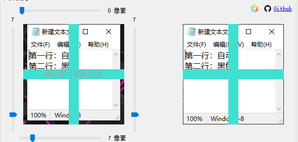
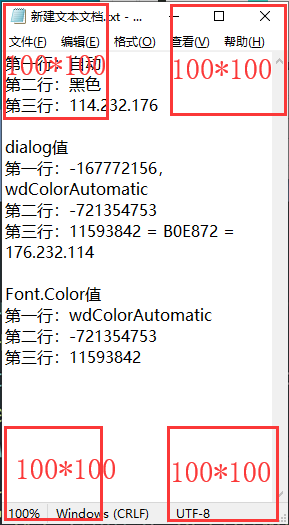
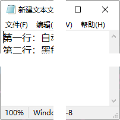

# 批量图片边框裁剪工具
裁剪图片的四周，获得新的图片

# 需求
QQ自带的截图可以获取程序窗口大小，然后截取整个程序的界面。但是有些窗体带有透明的阴影效果，导致截图时会四周会有不想要的背景，所以设计此程序来解决这个问题  

|正常| 不正常|
|----|-----|
|||

# 安装步骤
- 1. 下载安装文件并解压  

- 2. 双击“**setup.exe**”  

# 使用说明
## 方法一：使用界面（每次只能处理一张图片）
- 双击打开程序  
如果保存的有默认值的话，会加载默认值  

- 拖动图片到指定区域  

- 调整上下左右的四个滑块，使得右边的图片边框达到理想效果  

- 点击“**保存为默认**”按钮，将四个滑块值保存下来，下次启动程序时会直接填充

- 点击“**保存**”按钮，修改后的图片将被另外保存下来

    |Before|After|
    |------|-----|
    ||.png)|

## 方法二：拖动图片到程序上以执行程序（可以处理多张图片）
- 拖动一张或多张图片到程序上即可
- 程序内部执行的步骤
    - 1.调用用户设置的剪切值，默认的为   

        |上|下|左|右|
        |-|-|-|-|
        |0|0|0|0|
    - 2.剪掉图像的四条边的指定宽度，得到一张新的图片
    - 3.保存这张新的图片
    - 4.重复第二步，直到所有图片都处理完成

## 注
这里显示的图片是预览图片，便于观察四周的剪切情况的，不代表图片的本来样式

处理方式：  
- 1. 取图像的四个角的90\*90区域大小的图像，下图的100\*100有误  
    

- 2. 拼接四张图片，中间填充宽度为20的透明区域  
    

- 3. 得到新的200\*200大小的预览图像，程序的图像预览框就是200\*200
